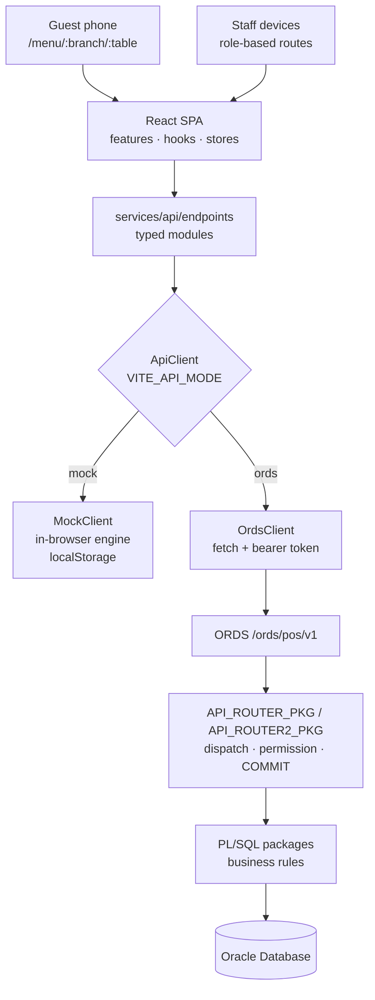

# Architecture — root overview

This is the map of the whole system: what the pieces are, where the boundaries fall, and which
rules are load-bearing.

> **This file does not replace [`docs/ARCHITECTURE.md`](docs/ARCHITECTURE.md), and deliberately
> does not repeat it.** That document is the Phase 1 design record — the workspace analysis, the
> original layer diagram, the frontend folder rationale, the Oracle package list, the status
> machines and the billing formula, written when those decisions were made. Read it for the detail
> behind any section here.
>
> This file adds what came after it: the workspace presentation system, the surface system, the
> realtime status lifecycle, the transaction boundary, and the cross-cutting flows.

Related: [`docs/API_SPEC.md`](docs/API_SPEC.md) (endpoints and their permissions),
[`docs/RBAC.md`](docs/RBAC.md) (the role matrix), [`docs/DATABASE.md`](docs/DATABASE.md)
(schema and packages), [`docs/WORKFLOWS.md`](docs/WORKFLOWS.md) (sequence and state diagrams),
[`docs/DESIGN_SYSTEM.md`](docs/DESIGN_SYSTEM.md) (tokens and layout).

---

## 1. Shape of the system

One React single-page application talks to one API through one typed interface. That interface has
two implementations, chosen at startup by a single environment variable.



The frontend contains **no billing or permission rule that the backend does not also enforce**.
Frontend copies exist for user experience — instant totals, disabled buttons, hidden nav items —
and are never the decision. See §5.

`frontend/src/services/api/index.ts` picks the implementation once and memoises it:

```ts
client = env.apiMode === 'ords'
  ? new OrdsClient(env.apiBaseUrl, tokenProvider)
  : new MockClient(tokenProvider, env.mockLatencyMs);
```

Because it is memoised, changing `VITE_API_MODE` needs a dev-server restart. Any value other than
the exact string `ords` selects the mock client.

**The mock client is not a stub.** It is a full in-browser engine
(`frontend/src/services/api/mock/engine/`, with Phase 2 under `engine/p2/`) that re-implements the
same business rules as the PL/SQL packages, persists to `localStorage` and publishes realtime
events. That is what makes the product demonstrable with no database — and it is also why it must
never be deployed: it authorises nothing that a determined user cannot bypass, because it runs on
their machine. See [`SECURITY.md`](SECURITY.md).

---

## 2. Frontend structure

`frontend/src` is organised by responsibility, not by screen. The full folder rationale is in
[`docs/ARCHITECTURE.md` §2](docs/ARCHITECTURE.md); the responsibilities that matter for reasoning
about change are:

| Folder | Owns | Must not |
|---|---|---|
| `config/` | Declarative truth: permissions, role homes, navigation, statuses, workspaces, surfaces, motion, chart theme | Call the API or hold state |
| `types/` | Domain types shared by UI, API layer and mock engine | Contain logic |
| `services/api/` | Transport and endpoint shape | Contain UI concerns |
| `services/realtime/` | Transport abstraction and status | Know what a query key means |
| `store/` | Session, cart and UI state (Zustand) | Cache server data |
| `hooks/` | Composition of the above for components | Contain feature logic |
| `components/ui/` | The design system | Import from `features/` |
| `layouts/` | Chrome: rail, header, bottom nav | Decide permissions |
| `features/` | One folder per domain area, 27 of them | Import another feature's internals |
| `utils/` | Pure functions: billing, status machine, offers, money, dates, CSV | Touch React or the network |

The three layouts are `AdminLayout` (sidebar), `PosLayout` (bottom navigation) and `DisplayLayout`
(kitchen/bar displays).

---

## 3. Routing, workspaces and surfaces

### Guards

`frontend/src/routes/guards.tsx` has three pieces:

- `ProtectedRoute` — redirects to `/login` when there is no token, no user, or the session has
  expired. It clears the store in an effect, never during render.
- `RequirePermission` — route-level RBAC. It renders an explicit **403 "Access denied"** screen
  rather than silently redirecting, so an operator learns *why* a screen is not available.
- `RoleHomeRedirect` — sends an authenticated user to `homeForRoles(user.roles)`.

### The workspace boundary — the rule that matters most

`frontend/src/config/workspace.ts` names four audiences: `admin`, `manager`, `operations` (waiter,
cashier, kitchen, bar, host) and `guest`. Two rules govern it, and both are load-bearing:

**1. A workspace is derived from the signed-in role, never from the URL.**

```ts
export function workspaceForRoles(roles: RoleCode[] | undefined | null): Workspace {
  const primary = roles?.length ? primaryRole(roles) : undefined;
  return primary ? BY_ROLE[primary] : 'guest';
}
```

`/admin/suppliers` is a route both an admin and a manager reach. The path prefix says where a
screen lives, not who is looking at it. Deriving presentation from the path would have given the
manager the admin's design on most of their screens and the manager's design to the admin on none.

**2. A workspace grants nothing.**

It selects a surface, a layout variant and a rail — nothing else. Every capability still comes from
`hasPermission`, a mirror of what the server enforces. Nothing in `workspace.ts` is ever consulted
by a guard, a mutation or an API call. If switching workspace could change what a request is
allowed to do, that file would be a privilege-escalation bug rather than a styling helper.
Read-only presentations are driven by the **absence of a permission**, never by the workspace.

`frontend/src/config/workspace.test.ts` covers the derivation.

### Surfaces

`frontend/src/config/surfaces.ts` declares, per route, whether the navigation rail and the content
region are charcoal or ivory, on two independent axes (`shell`, `content`). Route matching is
most-specific-first: more segments win, and a literal segment beats a `:param` at the same depth.

The admin table is **frozen** — its design is signed off. Every manager difference lives in a
separate `MANAGER_OVERRIDES` list consulted only when the signed-in role resolves to the manager
workspace, so nothing an admin sees can be changed by editing the manager's declarations. Below
the `lg` breakpoint the whole management shell is ivory, because a rail that changed colour between
tabs would read as a fault. In the light theme the distinction collapses entirely.

`hooks/useSurface.ts` resolves route + workspace + theme + viewport into the classes a layout
applies. No feature file contains a colour decision about its own shell.

---

## 4. State and data

Two systems, with a hard split:

- **Server state → TanStack Query 5.** Everything fetched. Cached, invalidated, refetched.
- **Client state → Zustand.** `authStore` (session, token, branch, `hasPermission`), `cartStore`
  (the order being composed), `uiStore` (theme, toasts).

Nothing that comes from the API is copied into Zustand. Nothing that is pure UI state is put into
Query. The one deliberate crossing is the token provider in `services/api/index.ts`, which reads
`useAuthStore.getState()` outside React so the HTTP client can attach credentials and react to a
401 by clearing the session and navigating to `/login?expired=1`.

Forms are React Hook Form with Zod resolvers.

---

## 5. Authentication, authorisation and branch isolation

**Sessions are opaque bearer tokens, not JWTs.** `02_pkg_core.sql` generates a token as 32 random
bytes from `DBMS_CRYPTO.RANDOMBYTES`, hex-encoded, and stores only its **SHA-256 hash** in
`user_sessions` alongside an expiry. Passwords are stored as a salted `HASH_SH512` digest with a
per-user 32-byte random salt. The token is sent as a bearer header; `authenticate` validates it,
sets the request context and raises 401 if it does not resolve.

**Permissions are data, enforced in the handler.** `SEC_PKG.assert_permission` raises 403 unless
the current user holds the code:

```sql
PROCEDURE assert_permission(p_permission VARCHAR2) IS
BEGIN
  IF api_pkg.current_user_id IS NULL THEN api_pkg.raise_unauth; END IF;
  IF NOT has_permission(api_pkg.current_user_id, p_permission) THEN
    api_pkg.raise_forbidden('Missing permission: ' || p_permission);
  END IF;
END;
```

The frontend's `permissions.ts` is a **mirror** of the same matrix, used for route guards and to
hide affordances. Removing a guard in the frontend does not grant anything; the handler still
refuses. `ROLE_MAX_DISCOUNT` is likewise mirrored — the server holds the authoritative cap in
`roles.max_discount_pct` and discounts above a user's cap require PIN approval.

**Branch isolation** is a server-side scope, not a filter the UI applies. The branch travels as an
`X-Branch-Id` header declared on the ORDS module, and queries scope to
`api_pkg.current_branch_id`. The router comment states the rule directly: *branch context switch
via `X-Branch-Id` (enforced server-side, never trusted from the UI alone)*. The mock engine mirrors
it — `userCanAccess` validates the header against `user_branches`, and a `SUPER_ADMIN` is checked
against the branch list rather than waved through.

### Transaction boundaries

**The business packages contain no `COMMIT` and no `ROLLBACK`.** `04_pkg_orders.sql`,
`05_pkg_billing.sql` and `09a_pkg_branch_inventory.sql` each contain zero of either. The router
owns the boundary: one dispatch, then a single `COMMIT` on success, and `ROLLBACK` in the
`WHEN OTHERS` handler before the error is mapped to an HTTP status and returned as a JSON failure.

That is what makes a multi-step operation atomic. Closing a bill writes payments, closes the order,
frees the table, posts stock movements, accrues loyalty points and emits realtime events — and
either all of it lands or none of it does, because no package committed halfway through.

Order and bill numbers come from a per-day sequence row locked with `SELECT … FOR UPDATE`, so
concurrent tills cannot collide or skip.

---

## 6. Realtime

`services/realtime/` abstracts the transport behind `RealtimeProvider`. Three implementations are
selected by `VITE_REALTIME_MODE`: `BroadcastRealtime` (mock, `BroadcastChannel` between tabs of one
browser), `PollingRealtime` (ORDS `GET /events`), and a `none` provider that reports status
`disabled` so the UI offers manual refresh instead of implying live updates that will never arrive.

UI code only ever calls `subscribe`. `TOPIC_QUERY_KEYS` maps each topic to the Query keys it
invalidates, which keeps components ignorant of event semantics — a component subscribes to
`orders` and does not need to know that a bill event also refreshes tables and the dashboard.

### Two clocks, deliberately not one

`StatusBus` tracks two independent timestamps, and conflating them is the exact failure this design
prevents:

- `lastSyncAt` — **health of the connection.** Updated by every successful exchange, including a
  poll that returns 200 with zero events.
- `lastEventAt` — **freshness of the data.** Updated only when a real business event arrives.

Status is decided by transport outcomes — a poll resolving, a poll failing twice, connect and
disconnect, the browser's online/offline events — and **never** by comparing a timestamp against
`now`. A quiet service can leave `lastEventAt` hours behind while the link is perfectly healthy; if
staleness were derived from it, a calm Tuesday afternoon would report the system as offline.

`services/realtime/realtime.test.tsx` covers the lifecycle.

---

## 7. The core flows


### Order → preparation

An order is composed in the cart, then **confirmed**. Confirmation is the commitment point: item
prices are snapshotted onto the order (so later menu edits cannot retroactively change a bill),
items are routed to the kitchen or the bar by their category's destination, and tickets appear on
the relevant display.

The parent order's status is **derived from its items**, never set directly, by
`deriveOrderStatus` in `utils/orderStatus.ts` — mirrored by `ORDER_PKG.derive_status`. Cancelled
items are excluded; all served is `SERVED`, all ready-or-served is `READY`, any ready is
`PARTIALLY_READY`, any preparing is `IN_PROGRESS`. Derivation stops once the order reaches
`BILL_REQUESTED`, so a late item status cannot drag a billed order backwards. Item transitions are
constrained by an explicit table: `NEW → PREPARING | READY | CANCELLED`, `PREPARING → READY |
CANCELLED`, `READY → SERVED | CANCELLED`, and `SERVED`/`CANCELLED` are terminal.

### Billing

`utils/billing.ts` is a pure, deterministic engine mirrored by `BILLING_PKG.calculate`, applied in
one fixed order:

```
item total → subtotal → item discounts → order discount → service charge → tax → rounding → grand total
```

Order-level discounts are apportioned back across lines (`orderDiscountShare`) so that per-line tax
is computed on the amount actually charged. Service charge may or may not be taxable, by setting.
Both implementations are unit-tested (`utils/billing.test.ts`) precisely because two
implementations of one formula is the classic place for them to drift.

Discounts above the signed-in user's `ROLE_MAX_DISCOUNT` require PIN approval from someone who
holds `orders:approve-discount`. Payments are split across methods — cash, UPI, card,
complimentary, loyalty redemption, club cover credit and room charge — and are reversible.

### Billing → stock

Stock never changes except through a **stock movement** row, and every movement carries an
**idempotency key** that is checked before insert. Retrying a request cannot double-deduct.

*When* an order consumes ingredients is a per-branch setting, not a hard-coded rule
(`09a_pkg_branch_inventory.sql`):

- `ON_CONFIRM` — deduct when the order is confirmed
- `ON_BILL_CLOSE` — deduct when the bill closes
- `MANUAL` — deduct only when someone asks, audited as `STOCK_DEDUCTED_MANUAL`

Quantities come from the menu item's recipe, converted into the stock unit and scaled by yield and
wastage. Cancelling reverses the movements. Costing is moving-average, which is what makes the
profitability and inventory-valuation reports mean anything.

---

## 8. Oracle side

`database/` holds the schema, the packages and the ORDS module. `run_all.sql` installs them in a
specific order — Phase 2 tables go in **before** the Phase 1 packages, because those packages now
reference Phase 2 columns — then recompiles the schema twice to resolve circular package
references, then asserts that no object is invalid, then seeds. The full ordered table is in the
[README](README.md#install-order); the schema itself is documented in
[`docs/DATABASE.md`](docs/DATABASE.md).

ORDS exposes a small number of catch-all handlers that delegate to `API_ROUTER_PKG`, which
dispatches on a `METHOD /path` key and falls through to `API_ROUTER2_PKG` (Phase 2) for anything it
does not recognise; unknown routes raise 404 there.

Design properties worth knowing before changing anything:

- **Soft delete** — records are flagged, not removed, so historical orders and bills stay readable.
- **Price snapshots** — `ORDER_ITEMS` and `BILL_ITEMS` store the price charged, not a reference to
  the current one.
- **History tables** — price changes are recorded rather than overwritten.
- **Audit log** — privileged and financial actions write an audit row; server errors log a backtrace.

> **Unverified.** No Oracle or ORDS instance was available in this environment. The SQL is written
> and internally consistent, but `run_all.sql` has not been executed against a real database and
> the `ords` API mode has not been exercised against a live server. See the README's
> [Known limitations](README.md#known-limitations).

---

## 9. Where to make a change

| Change | Files |
|---|---|
| A new permission | `frontend/src/config/permissions.ts`, `docs/RBAC.md`, the seed SQL, and a migration for existing installs |
| A new route | `frontend/src/app/router.tsx`, `config/navigation.ts`, and `config/surfaces.ts` if it is not charcoal |
| A new endpoint | `services/api/endpoints/`, the mock engine, the PL/SQL package, the router, `docs/API_SPEC.md` |
| A billing rule | `utils/billing.ts` **and** `BILLING_PKG.calculate` **and** `utils/billing.test.ts` |
| A status rule | `utils/orderStatus.ts` **and** `ORDER_PKG`, plus `config/statuses.ts` for presentation |
| A colour or token | `tailwind.config.ts` / `styles/index.css` — then re-run `verify-themes.mjs` in both themes |

Anything with "**and**" in that table is a mirrored rule. Changing one side and not the other is
the most expensive mistake available in this codebase, and the reason those specific files carry
unit tests.
