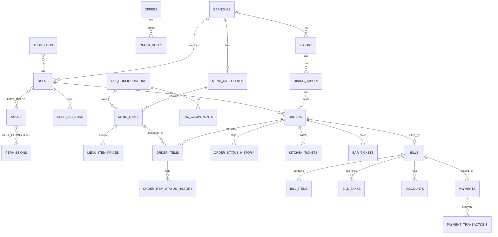

# Database design (Oracle)

Files: `database/01_schema.sql` (DDL), `02`–`05` packages, `06` router + ORDS, `07` seed. Run via `run_all.sql`.

## ER overview

## Table catalogue
| Table | Purpose | Notes |
|---|---|---|
| BRANCHES | Business/branch profile + billing rules | service charge %, tax-on-SC flag, rounding mode, multi-order flag |
| ROLES / PERMISSIONS / ROLE_PERMISSIONS / USER_ROLES | RBAC as data | `MAX_DISCOUNT_PCT` per role |
| USERS | Staff | SHA-512 salted hashes, approval PIN hash, lockout after 5 failures |
| USER_SESSIONS | Opaque bearer tokens (hashed) | expiry, revoke |
| FLOORS / DINING_TABLES | Layout | `PUBLIC_CODE` opaque QR token, `QR_VERSION`, `STATUS_OVERRIDE` |
| TAX_CONFIGURATIONS / TAX_COMPONENTS | Tax groups (GST5 = CGST 2.5 + SGST 2.5 …) | nothing hard-coded |
| MENU_CATEGORIES / MENU_ITEMS / MENU_ITEM_PRICES | Menu with price history | soft delete, availability |
| OFFERS / OFFER_RULES | Promotions | `V_OFFER_ACTIVE` computes "currently active" |
| DOC_SEQUENCES | Per-day counters for ORD/BILL/PAY/KOT/BOT | locked with `FOR UPDATE` |
| ORDERS / ORDER_ITEMS | Master order + routed items with **price snapshots** | unique active order per table (function-based unique index) |
| ORDER_STATUS_HISTORY / ORDER_ITEM_STATUS_HISTORY | Full lifecycle history | |
| KITCHEN_TICKETS / BAR_TICKETS | One per (order, batch, station) | status derived from items |
| BILLS / BILL_ITEMS / BILL_TAXES / DISCOUNTS | Billing snapshot & breakdown | one non-void bill per order |
| PAYMENTS / PAYMENT_TRANSACTIONS | Payments are separate rows; reversal never deletes | gateway-ready |
| AUDIT_LOGS | Who/what/when + old/new | autonomous transaction |
| REALTIME_EVENTS | Outbox for `/events` polling / future SSE | |

## Integrity rules enforced in the database
* Check constraints on every status column, quantities > 0, prices ≥ 0, percentages 0–100.
* `UQ_ORDERS_ACTIVE_TABLE` — a table cannot have two active orders (Rule 2).
* `UQ_BILLS_OPEN_ORDER` — one live bill per order.
* Soft-delete flags (`IS_DELETED`) on menu/tables/floors/offers/users; physical deletes are never issued on ORDERS, BILLS, PAYMENTS.
* Numbering: `NUMBERING_PKG.next_number` serialises on the `DOC_SEQUENCES` row → no duplicates under concurrency.
* Every mutation goes through a package that calls `SEC_PKG.assert_permission` and `AUDIT_PKG.log`.

## Package map
| Package | Responsibility |
|---|---|
| `API_PKG` | envelope, error codes → HTTP status, request context |
| `SEC_PKG` | password hashing, login/logout, session auth, permission checks |
| `NUMBERING_PKG` | ORD-/BILL-/PAY-/KOT-/BOT- numbers |
| `AUDIT_PKG` | audit + realtime outbox |
| `MENU_PKG`, `OFFER_PKG`, `TABLE_PKG`, `SETTINGS_PKG`, `USER_PKG` | masters |
| `ORDER_PKG`, `TICKET_PKG` | order lifecycle, routing, derivation |
| `BILLING_PKG`, `PAYMENT_PKG` | calculation, discounts, finalize, payments, reversal, close |
| `REPORT_PKG` | dashboard & reports |
| `API_ROUTER_PKG` | single dispatcher used by the ORDS catch-all handlers |
