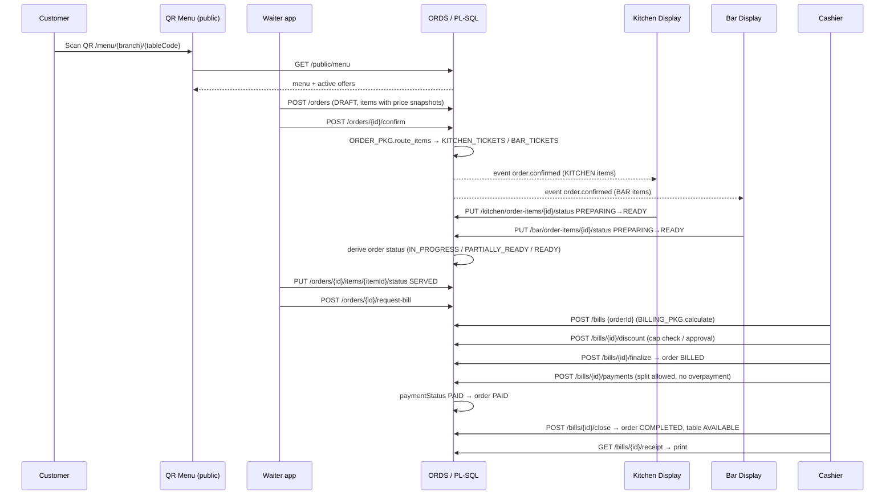
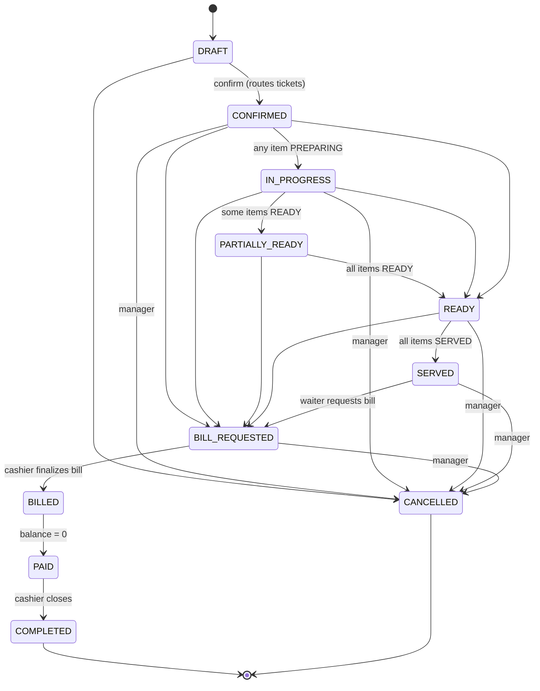

# Workflows

## End-to-end order lifecycle



## Order status state machine

Adding items to an existing order is allowed in any status ≤ SERVED; the new batch (`ORDER_ITEMS.BATCH_NO` + 1) is routed immediately if the order is already confirmed. Adding items after BILL_REQUESTED requires the cashier to reopen (bill must be OPEN, not finalized).

## Item cancellation
```
Waiter requests cancel ─► item NEW and order DRAFT? ── yes ─► cancelled, reason stored
                                   │ no
                                   ▼
                    manager approval (approvedByUserId + PIN in mock / manager session in ORDS)
                                   ▼
          item → CANCELLED, cancelled_by, approved_by, reason, timestamp; ticket line struck out
```

## Billing
```
Bill created (OPEN) ─► items snapshot from ORDER_ITEMS (non-cancelled) ─► offers auto-applied as item discounts
   ─► cashier adds order discount (cap check) ─► finalize (FINALIZED, order BILLED)
   ─► payments (CASH/UPI/CARD/COMPLIMENTARY; Σ ≤ grandTotal) ─► PAID ─► close (order COMPLETED, table AVAILABLE)
Reversal: POST /payments/{id}/reverse creates a REVERSED flag + reversal row; paid amount recomputed; never deleted.
```
